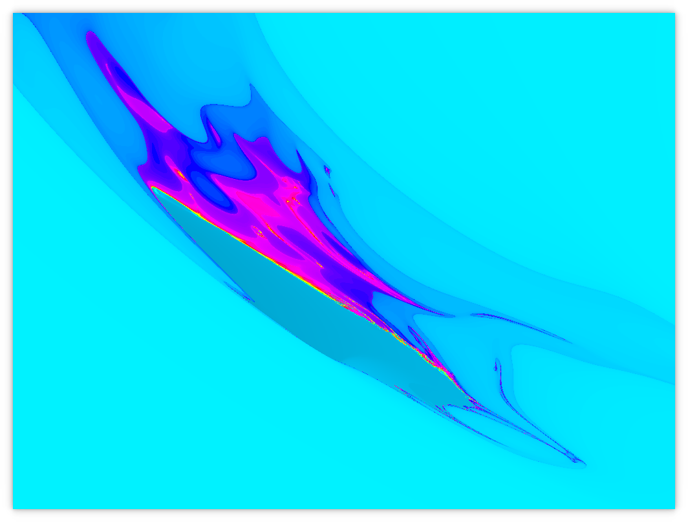

# quaterdrop
_or_
# Mandelbrot: s/ℂ/ℍ Edition

Named thusly 'cuz it kind of looks like a water drop at the top level. Also quaternions.

This is a GPU program that draws the Mandelbrot set, using quaternions instead of complex numbers.
(Quaternion fractals aren't a new idea, except to me.)

You probably want a reasonably good GPU.

Something approximately equivalent to the Julia Set available by editing `main` in `fragment.glsl`.
It's somewhat more difficult to find interesting space in it; an iteration depth of 200 is recommended.

The fractal viewer bit is forked from [remexre/mandelbrot-rust-gl](https://github.com/remexre/mandelbrot-rust-gl).


# Controls
```
left-drag: pan x,y
right-drag: pan z,w
scroll: zoom (x,y)
r: reload shader
o/p: change iteration depth limit by 1
lbracket/rbracket: change iteration depth limit by 10
space: reset zoom
period: print out draw parameters
```

# Interesting features
Collect all _n_.

* Maelstroms
* Theaters
* Spooky ghosts
* Creepy masks



Here's some other picture.

In general, the fractal is less regular than Mandelbrot, more wild & surprising.
Unlike Mandelbrot, there are edges where recurrence ceases.
Regularly recurring features are rare, but have been found.


